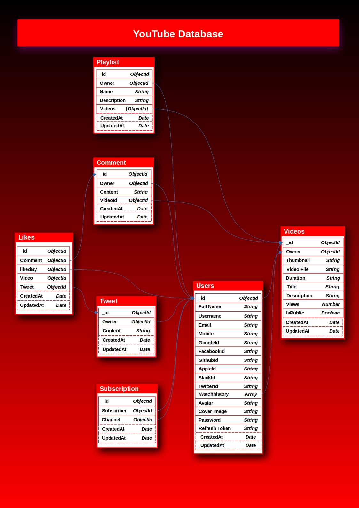

Welcome to the **YouTube - Node** project! 🚀

This project is built using **Node.js** to simulate YouTube's backend services. It is designed for practice and to learn how various backend features like user authentication, file uploading, and user engagement can be implemented in a real-world application. The project offers core functionalities like **login/logout**, **auth**, **like/comment system**, **playlist management**, **subscription system**, and more!

---

## Features ✨

### 🔐 **Authentication System**
- User registration and login with **JWT** authentication.
- Ability to log out and manage session tokens.

### 👍 **Like and Comment System**
- Users can **like** videos and leave **comments**.
- Real-time comment updates for interactive engagement.

### 🎬 **Video Upload via Cloudinary**
- Seamlessly upload video content to **Cloudinary** for fast storage and delivery.
- Each video uploaded is linked to a user’s profile.

### 📜 **Playlist Management**
- Users can **create, edit, and delete playlists**.
- Organize your favorite videos into personal playlists.

### 🔔 **Subscription System**
- Users can **subscribe** to channels and get notifications of new content.
- Manage and track subscriptions directly from the user dashboard.

### 🧑‍💻 **User Dashboard**
- View **profile information** and uploaded videos.
- Edit user details, change passwords, and view comments.

---

## Tech Stack 🛠️

- **Backend**: Node.js
- **Database**: MongoDB
- **Authentication**: JWT (JSON Web Token)
- **Cloud Storage**: Cloudinary (for video and image uploads)
- **Framework**: Express.js

# YOUTUBE - NODE

